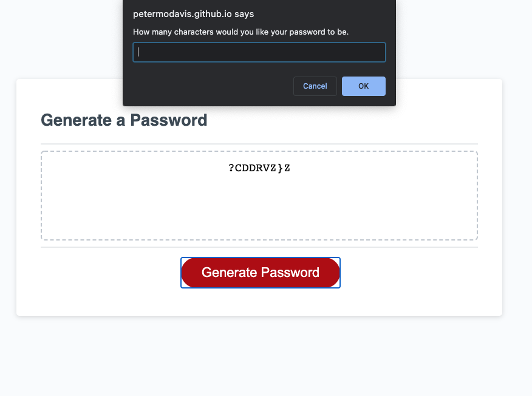
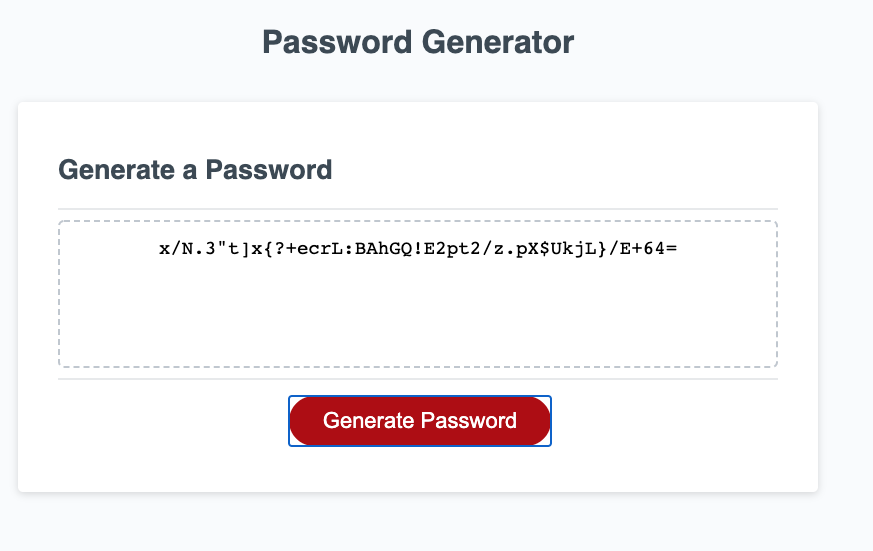

# Password Generator

## Description

I wanted to use JavaScript to provide logic so that the App would generate a random password using guidelines submitted by the user. Now instead of the user having to come up with their own random passwords they can just type in their criteria and voila, a password is created. While making this project I utilized some of my skills to make what I consider a pretty concise bit of code. I tried to keep it DRY as possible and provided comments so that I could understand it easily. I also had to figure out some fairly confusing bugs involving "length" lacking a "- 1" that was throwing my number of characters out of whack. Also, renaming your Github repository is a pain!

You can use the Password Generator [HERE](https://petermodavis.github.io/Password-Generator/)

## Usage

Just press the Generate Password button. Answer some questions and it will generate a password.

MIT License

Copyright (c) [2021] [Peter MoDavis]

Permission is hereby granted, free of charge, to any person obtaining a copy
of this software and associated documentation files (the "Software"), to deal
in the Software without restriction, including without limitation the rights
to use, copy, modify, merge, publish, distribute, sublicense, and/or sell
copies of the Software, and to permit persons to whom the Software is
furnished to do so, subject to the following conditions:

The above copyright notice and this permission notice shall be included in all
copies or substantial portions of the Software.

THE SOFTWARE IS PROVIDED "AS IS", WITHOUT WARRANTY OF ANY KIND, EXPRESS OR
IMPLIED, INCLUDING BUT NOT LIMITED TO THE WARRANTIES OF MERCHANTABILITY,
FITNESS FOR A PARTICULAR PURPOSE AND NONINFRINGEMENT. IN NO EVENT SHALL THE
AUTHORS OR COPYRIGHT HOLDERS BE LIABLE FOR ANY CLAIM, DAMAGES OR OTHER
LIABILITY, WHETHER IN AN ACTION OF CONTRACT, TORT OR OTHERWISE, ARISING FROM,
OUT OF OR IN CONNECTION WITH THE SOFTWARE OR THE USE OR OTHER DEALINGS IN THE
SOFTWARE.

## Badges

